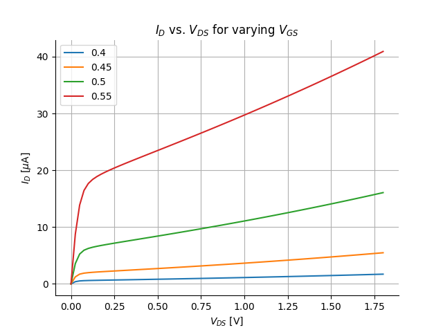
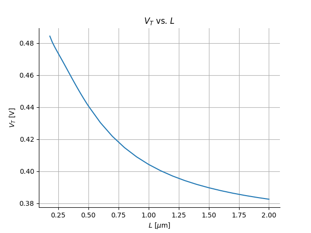
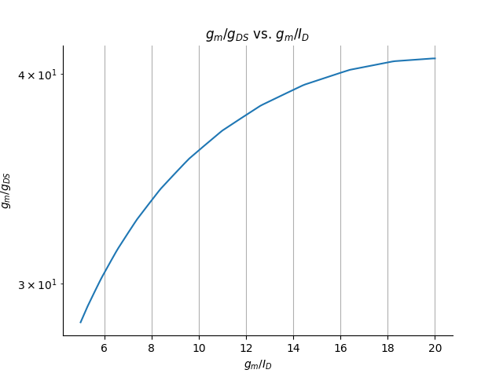
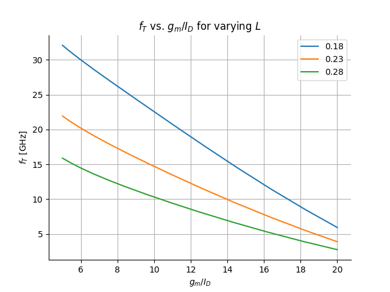
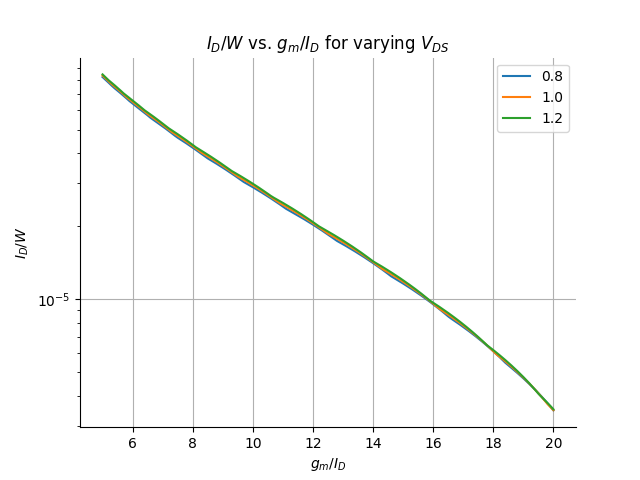
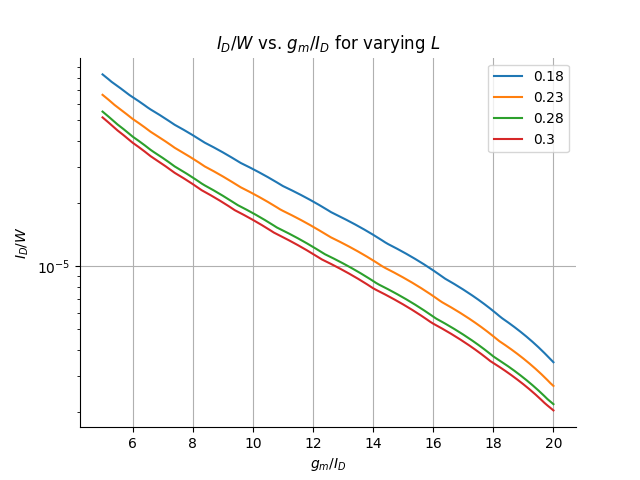

<p align="center">
  <a>
    
  </a>

  <h3 align="center">pygmid</h3>

  <p align="center">
    A python implementation of the gm/ID starter kit
    <br>
    <a href="https://www.github.com/madrasalach/pygmid/issues/new?template=bug.md">Report bug</a>
    ·
    <a href="https://www.github.com/madrasalach/pygmid/issues/new?template=feature.md&labels=feature">Request feature</a>
  </p>
</p>

## Table of contents

- [About](#about)
- [Installation](#installation)
- [Usage](#usage)
- [TODO](#todo)
- [Authors](#authors)

## About

pygmid is a Python 3 port of the gm/ID starter kit by Prof. Boris Murmann 
of Stanford University. 

For the gm/ID starter kit, written for MATLAB, please refer to the 'Links'
section at Prof. Murmann's website: https://web.stanford.edu/~murmann.
For the Python 2 version of this port, please see https://github.com/ashwith/pyMOSChar.

## Installation

To install pygmid from source, download from Github and run pip:

`pip install .`

 in the root directory.

 pygmid can also be installed from PyPI:

`pip install pygmid`

## Usage

### Scripting with the Lookup Class
A gm/ID lookup object can be generated with the `Lookup` class. The lookup object requires lookup data for initialisation. Currently, only `.mat` files are supported.

You can create a lookup object as follows:

```python
from pygmid import Lookup as lk

NCH = lk('180nch.mat')
```
### Access MOS Data
The `Lookup` class allows for pseudo array access of the MOS matrix data. You can access data as follows:

```python
# get VGS data as array from NCH
VGS_array = NCH['VGS']
```

Data is returned as a deep copy of the array contained in the `Lookup` object.

### Lookup functionality 

Lookup of interpolated data occurs as follows:

```python
VDSs = NCH['VDS'] 
VGSs = np.arange(0.4, 0.6, 0.05)
# Plot ID versus VDS
ID = NCH.look_up('ID', vds=VDSs, vgs=VGSs)
# alias function lookup can also be used
ID = NCH.lookup('ID', vds=VDSs, vgs=VGSs)
# check bias
VGS = NCH.look_upVGS(GM_ID = 10, VDS = 0.6, VSB = 0.1, L = 0.18)
print(f'VGS is: {VGS}')

plt.plot(VDSs, np.transpose(ID))
```

~~Currently only lookup modes 1 and 2 are implemented.~~
Modes 1 (Simple parameter lookup), mode 2 (arbitrary ratio lookup) and mode 3 (cross lookup of ratios) are implemented. The companion lookupVGS function is also included.

### Examples

Usage of lookup scripts are given in `test_lookup.py` and `test_lookupVGS.py`.

Sample outputs are given below:













### Command Line Interface (CLI)

`pygmid` also features a CLI which can be used to run techweeps to generate transistor data

## !TODO
- ~~look_up MODE 3 (ratio vs ratio)~~
- ~~look_upVGS and lookupVGS~~
- SPECTRE techsweep
- Support for non .mat data structures
- Improved logging for error generation

## Authors

- Cian O'Donnell : cian.odonnell@tyndall.ie
- Danylo Galach

A special thanks to Prof. Boris Murmann for giving permission to use his work and release this package under the Apache 2.0 License.
